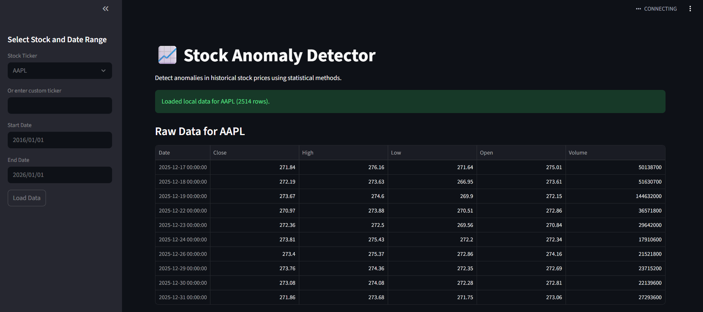
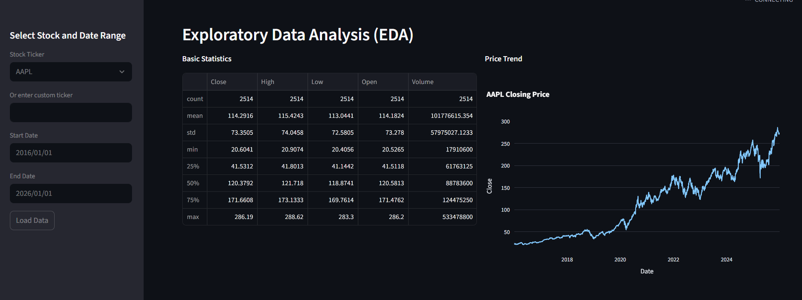
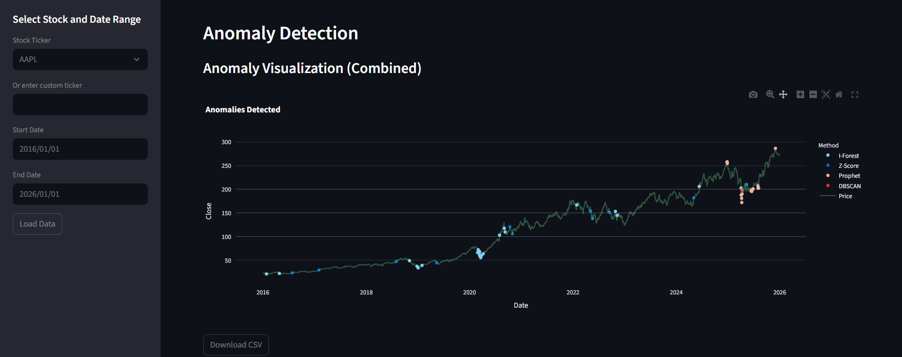

# Stock Anomaly Detector

[](https://github.com/TomasPosada0626/Stock-Anomaly-Detector/actions/workflows/ci.yml)
[](https://codecov.io/gh/TomasPosada0626/Stock-Anomaly-Detector)

Production-minded anomaly detection project for historical stock prices, with a Streamlit app, modular Python services, security-hardened authentication, and CI/CD validation workflows.

Live demo:
- https://stock-anomaly-detector-tomas.streamlit.app/

## Table of Contents
- [Overview](#overview)
- [Core Features](#core-features)
- [Detection Methods](#detection-methods)
- [Method Comparison](#method-comparison)
- [Architecture Summary](#architecture-summary)
- [Project Structure](#project-structure)
- [Quick Start](#quick-start)
- [Configuration](#configuration)
- [How to Use the App](#how-to-use-the-app)
- [Testing, Quality, and Security](#testing-quality-and-security)
- [Deployment](#deployment)
- [Notebooks and Case Studies](#notebooks-and-case-studies)
- [Documentation Index](#documentation-index)
- [Known Limitations](#known-limitations)
- [Roadmap](#roadmap)
- [Screenshots](#screenshots)
- [Contributing](#contributing)
- [Contact](#contact)
- [License](#license)

## Overview
Stock Anomaly Detector helps identify unusual behavior in stock time series using multiple statistical and machine-learning techniques.

This repository is designed to be:
- Portfolio-ready for recruiters and technical interviews.
- Practical for experimentation with interchangeable methods.
- Maintainable through tests, linting, formatting, and security checks.

## Core Features
- Interactive Streamlit UI for multi-ticker analysis.
- Register/login flow with:
  - bcrypt password hashing
  - lockout policy after failed attempts
  - expiring sessions
  - auth audit records
- Cached market data workflow (local CSV + Yahoo Finance fallback).
- Side-by-side anomaly visualization and benchmark table.
- CSV and PNG export support.
- Organized docs, runbook, and operational workflows.

## Detection Methods
- Z-Score
- Isolation Forest
- DBSCAN
- Prophet residual analysis
- Rolling Quantile bounds

## Method Comparison

| Method | Strengths | Weaknesses | Best Use Case |
|---|---|---|---|
| Z-Score | Very fast and interpretable | Assumes distribution stability | Fast baseline checks |
| Isolation Forest | Strong general outlier detector | Needs contamination tuning | Mixed behavior data |
| DBSCAN | Captures density anomalies | Sensitive to eps/min_samples | Regime and cluster shifts |
| Prophet | Trend and seasonality aware | Heavier runtime and fit cost | Structured time series |
| Rolling Quantile | Non-parametric and robust | Window/quantile tuning needed | Extreme movement monitoring |

## Architecture Summary
The app follows a modular structure:
- UI layer in [src/ui](src/ui)
- Service layer in [src/services](src/services)
- Config package in [src/config](src/config)
- Detection algorithms in [src/anomaly_methods.py](src/anomaly_methods.py)
- Streamlit entrypoint in [src/app.py](src/app.py)

Detailed architecture documentation:
- [docs/architecture/ARCHITECTURE.md](docs/architecture/ARCHITECTURE.md)

## Project Structure

```text
src/
  app.py
  anomaly_methods.py
  utils.py
  config/
    __init__.py
    settings.py
  services/
    auth_service.py
    market_data_service.py
    observability.py
  ui/
    auth_ui.py
    charts.py

tests/
  test_anomaly_methods.py
  test_auth_integration.py
  test_market_data_service.py
  test_streamlit_smoke.py
  test_ui_charts.py

docs/
  architecture/
    ARCHITECTURE.md
  guides/
    FAQ.md
  operations/
    DEPLOYMENT.md
    RUNBOOK.md
  project/
    CHANGELOG.md
    CONTRIBUTING.md
    CONTRIBUTORS.md

config/
  env/
    .env.development.example
    .env.production.example

scripts/
  download_all_tickers.py

data/
notebooks/
storage/
Taskfile.yml
README.md
```

## Quick Start

### Windows PowerShell

```powershell
python -m venv .venv
.\.venv\Scripts\Activate.ps1
pip install -r requirements.txt
streamlit run src/app.py
```

Open:
- http://localhost:8501

## Configuration
Base env file:

```powershell
Copy-Item .env.example .env
```

Environment profiles:
- [config/env/.env.development.example](config/env/.env.development.example)
- [config/env/.env.production.example](config/env/.env.production.example)

Main settings:
- USERS_DB_PATH (default: storage/users.db)
- APP_LOG_DIR (default: storage/logs)
- SESSION_TTL_MINUTES
- MAX_FAILED_LOGIN_ATTEMPTS
- LOCKOUT_MINUTES

## How to Use the App
1. Open the app and register or log in.
2. Select one or more tickers and a date range.
3. Choose detection methods and tune parameters from the sidebar.
4. Click Load Data.
5. Review:
   - raw data
   - EDA statistics
   - anomaly chart overlays
   - method benchmark table
6. Export results as CSV or PNG when needed.

## Testing, Quality, and Security
Run test suite:

```bash
pytest
```

Run coverage:

```bash
pytest --cov=src --cov-report=term-missing
```

Run lint/format checks:

```bash
ruff check src/services src/ui tests src/app.py src/config
black --check src/services src/ui tests src/app.py src/config
```

Run security checks:

```bash
bandit -r src/services src/ui -ll
pip-audit -r requirements.txt
```

Optional task runner commands (from [Taskfile.yml](Taskfile.yml)):

```bash
task test
task quality
task coverage
task security
task run
```

## Deployment
Deployment docs:
- [docs/operations/DEPLOYMENT.md](docs/operations/DEPLOYMENT.md)
- [docs/operations/RUNBOOK.md](docs/operations/RUNBOOK.md)

Supported flows:
- Local Python run
- Docker container run
- Streamlit Community Cloud

CI/CD status:
- CI validates tests, coverage threshold, lint, format, and security scans.
- CD validates post-CI app health/smoke checks.

## Notebooks and Case Studies
- [notebooks/stock_anomaly_analysis.ipynb](notebooks/stock_anomaly_analysis.ipynb)
- [notebooks/deep_learning_anomaly_case_studies.ipynb](notebooks/deep_learning_anomaly_case_studies.ipynb)

These notebooks provide deeper experimentation, comparative analysis, and advanced modeling examples.

## Documentation Index
- FAQ and usage: [docs/guides/FAQ.md](docs/guides/FAQ.md)
- Architecture: [docs/architecture/ARCHITECTURE.md](docs/architecture/ARCHITECTURE.md)
- Deployment guide: [docs/operations/DEPLOYMENT.md](docs/operations/DEPLOYMENT.md)
- Operations runbook: [docs/operations/RUNBOOK.md](docs/operations/RUNBOOK.md)
- Contributing: [docs/project/CONTRIBUTING.md](docs/project/CONTRIBUTING.md)
- Changelog: [docs/project/CHANGELOG.md](docs/project/CHANGELOG.md)
- Contributors: [docs/project/CONTRIBUTORS.md](docs/project/CONTRIBUTORS.md)

## Known Limitations
- Uses historical price data only (no integrated sentiment/news pipeline).
- Unsupervised anomalies do not provide absolute ground truth labels.
- Hyperparameters are configurable but not auto-optimized.
- Very large datasets may need additional performance tuning.

## Roadmap
- Expand deep-learning methods into app runtime.
- Add richer benchmark reporting across tickers and methods.
- Improve observability with additional operational metrics.
- Optionally expose a lightweight API layer.

## Screenshots

| Main Dashboard | EDA View | Anomaly Visualization |
|---|---|---|
|  |  |  |

## Contributing
Contribution guidelines:
- [docs/project/CONTRIBUTING.md](docs/project/CONTRIBUTING.md)

## Contact
Project author: Tomas Posada

For issues or collaboration:
- Open a GitHub issue in this repository.

## License
MIT License.

See [LICENSE](LICENSE).
